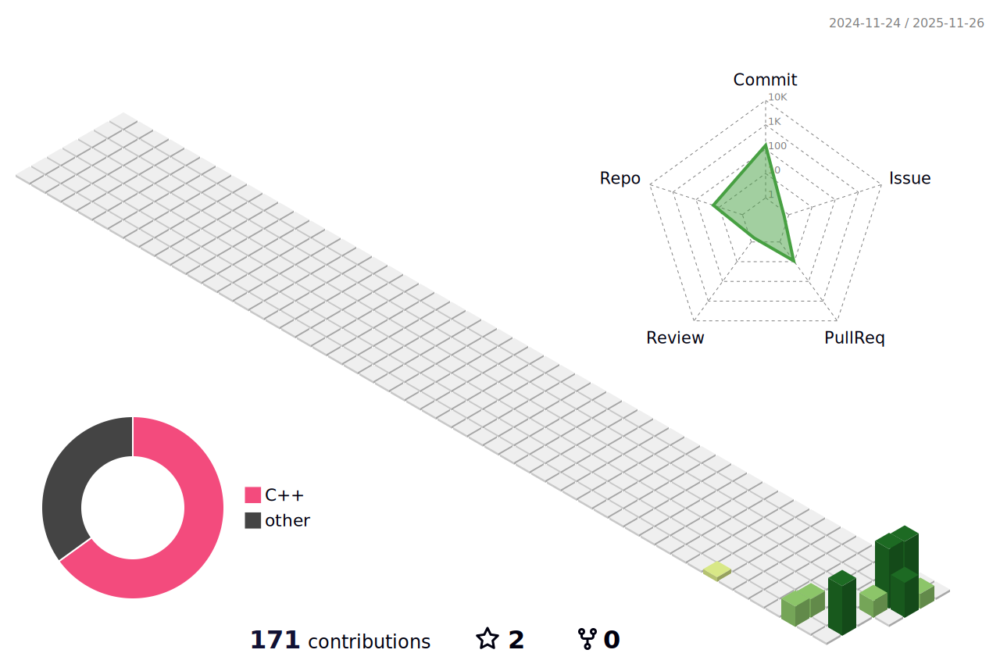

<p align="center">
  <!-- Large dynamic GitHub stats -->
  
</p>

<p align="center">
  <!-- Tools / Tech badges -->
  
  
  
  
  
  
</p>

---

## 📫 Contact
<p align="center">
  <a href="mailto:mohamedraghebv@gmail.com"></a>
  <a href="https://github.com/MohamedRaghebOmer"></a>
  <a href="https://www.linkedin.com/in/mohamed-ragheb-706929395"></a>
</p>

---

## ⚡ About Me
- 👋 Hi, I'm **Mohamed Ragheb** — Computer Science student.  
- 💻 Currently focused on **C++**, **C#**, and **Git/GitHub**.  
- 🎯 Goal: **Full Stack Web Developer**.  
- 🌍 Location: Damietta, Egypt.

---

## 🚀 Currently Learning
- **C#**  
- **Backend Development with .NET**  
- **Data Structures & Algorithms**

---

## 🛠️ Skills & Tools
- Languages: C++, C# (learning), basic scripting.  
- Tools: Visual Studio 2022, Git, GitHub, Notepad++.  
- Concepts: OOP, data structures, version control, backend fundamentals.

---

## 🔭 Projects (examples)
> Links point to your GitHub profile — replace with specific repo URLs when ready.

| Project | Description | Link |
|--------:|-------------|------|
| Personal Portfolio | Portfolio / CV website (coming soon) | [Repo](https://github.com/MohamedRaghebOmer) |
| C++ Exercises | Practice projects & coding exercises | [Repo](https://github.com/MohamedRaghebOmer) |
| Git & GitHub Demos | Small demos: branches, merges, workflows | [Repo](https://github.com/MohamedRaghebOmer) |

---

## 📊 GitHub Activity & Animated Stats

<p align="center">
  <!-- Contribution heatmap (animated SVG will show once you add the profile-3d-contrib files/action) -->
  
</p>

<p align="center">
  <!-- Streak / activity badges -->
  
  
</p>

<details>
  <summary>Click to view more GitHub stats</summary><br/>


</details>

---

## ⏱️ Coding Snapshot (example)
```text
Languages:
C++      ████████████░░░░  60%
C#       ███████░░░░░░░   25%
Other    ███░░░░░░░░░░░    15%

Daily average: 2 - 4 hrs (varies)
