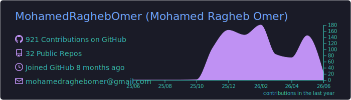
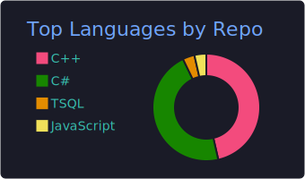
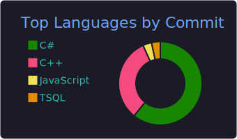
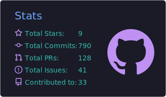
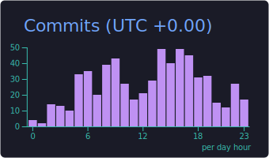

# Hi, I'm Mohamed Ragheb Omer 👋

### ASP.NET Core Backend Developer | Egypt 🇪🇬

---

## 👨‍💻 About Me

I’m **Mohamed Ragheb Omer**, a passionate **ASP.NET Core Backend Developer** from Egypt.
I enjoy building **strong, clean, and scalable backend systems** and turning ideas into well-structured APIs.

What makes me stand out is my long-term passion for programming, my continuous drive to learn, and my belief that every day is a step toward becoming a better version of myself.
I also built a strong foundation in **C++** before moving into **C#**, which helped me understand programming deeply from the start.

I’m currently expanding my skills in **web development** so I can grow into a **Full-Stack Developer** in the future.

---

## 🛠️ Tech Stack

  
  
  
  
  
  
  
  
  
  
  
  
  
  
  
  
  
  

---

## 🚀 Currently Focusing On

- **Web Development**
- Growing toward **Full-Stack Development**
- Building stronger knowledge in **Backend Architecture** and **Scalable APIs**

---

## 📌 Featured Projects

### 🔹 DVLD - Driving Vehicle License Department
A desktop application for managing vehicle licensing and driver-related operations.

**Tech Stack:** C#, ADO.NET, .NET Framework 4.8, WinForms  
**Repository:** [DVLD](https://github.com/MohamedRaghebOmer/DVLD-Driving-Vehicle-License-Department)

### 🔹 SMS - Supermarket Management System
A system for managing supermarket operations, including customers, ledgers, product stock, and role-based user permissions.

**Tech Stack:** ASP.NET Core 10, T-SQL  
**Repository:** [SMS](https://github.com/MohamedRaghebOmer/SMS-Supermarket-Management-System)

---

## 📊 GitHub Stats

  
  
  
  
  

---

## 🧠 My Background

- Strong foundation in **C++**
- Practical experience with **Desktop Development**
- Focused on **clean code** and **well-structured backend systems**
- Always learning, improving, and pushing forward

---

## 🏆 Certifications & Learning

I completed a structured roadmap and earned certificates for each course on my LinkedIn profile.

**LinkedIn:** [mohamedraghebomer](https://www.linkedin.com/in/mohamedraghebomer)

---

## 📫 Contact Me

  
  
  <a href="mailto:mohamedraghebomer@gmail.com">
    
  
  

---

## ✨ Quote

> “Small steps every day create massive results over time.”

### Fun fact:
I enjoy playing chess ♟️

---

**Thanks for visiting my profile!**

