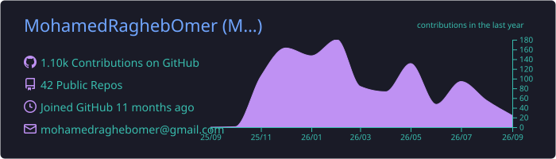
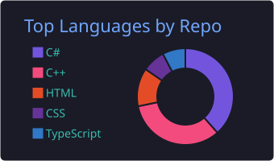
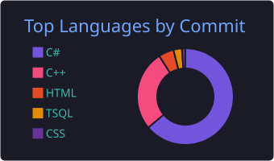
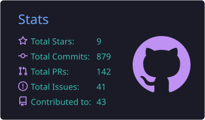
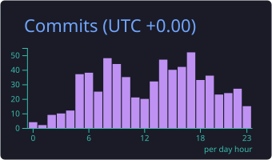

# Hi, I'm Mohamed Ragheb Omer 👋

### Full Stack Developer (.NET & React) | Egypt 🇪🇬

🌐 Portfolio: <a href="https://mohamedragheb.dev" target="_blank" rel="noopener noreferrer">mohamedragheb.dev</a>

<a href="Mohamed_Ragheb_Omer_CV.pdf" target="_blank" rel="noopener noreferrer">📄 Download My CV</a>

---

## 👨‍💻 About Me

I'm Mohamed Ragheb Omer, a **Full Stack Developer** specializing in **ASP.NET Core** and **React**, focused on building scalable, maintainable, production-ready software from the database up to the UI.

I combine a solid foundation in software engineering with hands-on experience across both ends of the stack — designing ASP.NET Core Web APIs with C#, Entity Framework Core, SQL Server, PostgreSQL, and SQLite, and building modern, responsive interfaces with React, TypeScript, and Tailwind CSS.

My approach emphasizes **Clean Architecture**, **Domain-Driven Design**, and separation of concerns — writing software that stays reliable and easy to extend as systems grow.

---

## 🛠️ Tech Stack

 
   
   
   
   
   
   
   
   
   
   
   
   
   
   
   
   
   
   
   
   
   
   
   
   
   
   
   
   
   
   
   

---

## 🚀 Currently Focusing On

- Building **end-to-end applications** with ASP.NET Core APIs and React frontends
- Deepening my knowledge of **scalable backend architecture** and cloud deployment on **Azure**
- Sharpening frontend craft with **TypeScript**, **Tailwind CSS**, and **Material UI**

---

## 📌 Selected Projects

### 🦷 Dental Management System

A comprehensive management system built for a real dental clinic to streamline daily operations — patient management, appointments, visits, treatments, prescriptions, payments, and radiographs.

- Applied **Clean Architecture**, **Domain-Driven Design (DDD)**, and the **Repository Pattern** for a scalable, maintainable backend.
- Designed and implemented complete clinical workflows across the full patient journey.
- Built a relational **SQLite** database with **10+ interconnected tables** using **Entity Framework Core**, with managed migrations.
- Delivered for a real client, collaborating through development and post-deployment improvements.
- Integrated **Serilog** for structured application logging.

**Key Features:** Patient Management · Appointment Scheduling · Visit & Treatment Management · Prescription Management · Payment Tracking · Radiograph Management · EF Core Migrations · Structured Logging

**Tech Stack:** C#, ASP.NET Core, WinForms, Entity Framework Core, SQLite, Clean Architecture, DDD, Repository Pattern, Serilog

**Demo:** <a href="https://www.youtube.com/watch?v=ObpU8mq26vk" target="_blank" rel="noopener noreferrer">Watch on YouTube</a> · **Source:** <a href="https://github.com/MohamedRaghebOmer/Dental-Management-System" target="_blank" rel="noopener noreferrer">GitHub Repo</a>

### 🛒 SMS — Supermarket Management System

A layered backend system for supermarket operations, covering authentication, authorization, auditing, sales, returns, customer accounts, inventory, and financial ledger tracking.

- Built a role-based and entity-level permission system using bitwise operations for fine-grained authorization.
- Implemented **JWT** authentication with secure password hashing and session management.
- Designed a clean, scalable layered architecture separating Domain, Application, and Infrastructure concerns.
- Developed full sales and return workflows with inventory updates and financial calculations.
- Designed a fully normalized relational database supporting complex business workflows.

**Key Features:** JWT Authentication & Refresh Tokens · Role & Permission Management · Audit Logging · Sales & Returns Management · Inventory Tracking · Customer Ledger System

**Tech Stack:** C#, ADO.NET, ASP.NET Core 10, T-SQL

**Source:** <a href="https://github.com/MohamedRaghebOmer/SMS-Supermarket-Management-System" target="_blank" rel="noopener noreferrer">GitHub Repo</a>

### 🪪 DVLD — Driving & Vehicle License Department

A desktop application managing the full lifecycle of driving licenses, including multi-stage testing, financial transactions, and regulatory compliance.

- Designed a normalized database schema with relationships and constraints.
- Built stored procedures to handle complex business logic at the database level.
- Developed a multi-layered validation engine automating eligibility checks and preventing duplicate applications.
- Enforced age and license-class eligibility rules while preventing conflicting requests.

**Key Features:** Multi-stage license workflow (Vision → Written → Practical) · Smart appointment scheduling · Automated eligibility & validation · Duplicate/conflict prevention · Issuance, renewal, replacement & international license support · Integrated driver/applicant management

**Tech Stack:** C#, ADO.NET, .NET Framework 4.8, WinForms

**Source:** <a href="https://github.com/MohamedRaghebOmer/DVLD-Driving-Vehicle-License-Department" target="_blank" rel="noopener noreferrer">GitHub Repo</a> · **Demo:** <a href="https://youtu.be/3lIlErl78XY?si=yvqzm_DiIOdT-x9W" target="_blank" rel="noopener noreferrer">Watch on YouTube</a>

---

## 📊 GitHub Stats

  
  
  
  
  

---

## 🧠 My Background

- **Backend Development:** C#, ASP.NET Core Web API, RESTful APIs, Entity Framework Core, Clean Architecture, Authentication & Authorization (JWT), Dependency Injection, Middleware, LINQ, Logging, Auditing
- **Frontend Development:** React, TypeScript, JavaScript, Tailwind CSS, Material UI, Responsive UI Design
- **Database:** SQL Server, T-SQL, Redis, Database Design
- **Desktop Development:** WinForms / WPF
- **Tools & DevOps:** Git & GitHub, Docker, Azure, Postman, Swagger/OpenAPI, Visual Studio, VS Code, SSMS
- **Soft Skills:** Problem Solving & Debugging, Analytical Thinking, Team Collaboration, Effective Communication, Attention to Detail, Continuous Learning, Time Management

---

## 🏆 Certifications & Learning

I completed a structured roadmap and earned certificates for each course, listed on my LinkedIn profile: <a href="https://www.linkedin.com/in/mohamedraghebomer" target="_blank" rel="noopener noreferrer">mohamedraghebomer</a>

---

## 📫 Contact Me

  
  
  
  
  
  

---

## ✨ Quote

> "Small steps every day create massive results over time."

**Fun fact:** I enjoy playing chess ♟️

**Thanks for visiting my profile!**

